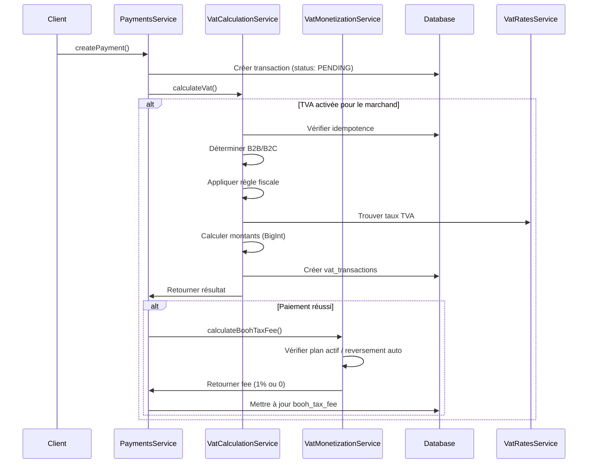

# Analyse Experte : Gestion de la TVA dans BööhPay

**Date d'analyse** : 30 novembre 2025  
**Version du système** : Production  
**Analyste** : Expert en systèmes fiscaux et architecture SaaS

---

## 📋 Table des matières

1. [Architecture globale](#architecture-globale)
2. [Flux de calcul de la TVA](#flux-de-calcul-de-la-tva)
3. [Modèle de données](#modèle-de-données)
4. [Monétisation](#monétisation)
5. [Points forts](#points-forts)
6. [Points d'amélioration](#points-damélioration)
7. [Recommandations stratégiques](#recommandations-stratégiques)
8. [Risques et conformité](#risques-et-conformité)

---

## 🏗️ Architecture globale

### Vue d'ensemble

Le système de gestion de la TVA de BööhPay est **modulaire, extensible et bien architecturé**. Il suit les principes SOLID et utilise une séparation claire des responsabilités.

### Composants principaux

```
┌─────────────────────────────────────────────────────────────┐
│                    VAT MODULE (NestJS)                      │
├─────────────────────────────────────────────────────────────┤
│                                                               │
│  ┌──────────────────┐  ┌──────────────────┐                │
│  │ VAT Calculation  │  │  VAT Settings    │                │
│  │    Service       │  │    Service       │                │
│  └──────────────────┘  └──────────────────┘                │
│                                                               │
│  ┌──────────────────┐  ┌──────────────────┐                │
│  │  VAT Reports     │  │  VAT Payments    │                │
│  │    Service       │  │    Service       │                │
│  └──────────────────┘  └──────────────────┘                │
│                                                               │
│  ┌──────────────────┐  ┌──────────────────┐                │
│  │ VAT Monetization │  │ VAT Subscription │                │
│  │    Service       │  │    Service       │                │
│  └──────────────────┘  └──────────────────┘                │
│                                                               │
│  ┌──────────────────┐  ┌──────────────────┐                │
│  │   VAT Rates      │  │  VAT Provider    │                │
│  │    Service       │  │  Validation      │                │
│  └──────────────────┘  └──────────────────┘                │
│                                                               │
└─────────────────────────────────────────────────────────────┘
         │                    │                    │
         ▼                    ▼                    ▼
┌─────────────────────────────────────────────────────────────┐
│              PAYMENTS SERVICE (Intégration)                 │
│  • Calcul automatique lors du paiement                     │
│  • Stockage de vatAmount, vatRateApplied, boohTaxFee       │
└─────────────────────────────────────────────────────────────┘
```

### Services clés

1. **VatCalculationService** : Cœur du système
   - Calcul idempotent de la TVA
   - Gestion B2B/B2C
   - Support reverse charge
   - Calculs en BigInt pour précision

2. **VatSettingsService** : Configuration marchand
   - Paramètres par marchand
   - Reversement automatique
   - Détection automatique du pays acheteur

3. **VatMonetizationService** : Modèle économique
   - Calcul des frais BööhTax (1% de la TVA)
   - Gestion des abonnements (TAX_PRO, BUSINESS_SUITE)
   - Frais de reversement (1%, min 300 XAF)

4. **VatReportsService** : Génération de rapports
   - Rapports périodiques
   - Export CSV/XLSX/PDF (à implémenter)
   - Statuts : DRAFT → SUBMITTED → PAID

5. **VatPaymentsService** : Reversements automatiques
   - Exécution des reversements
   - Calcul automatique des frais
   - Intégration avec providers de paiement

---

## 🔄 Flux de calcul de la TVA

### 1. Création d'un paiement



### 2. Logique de calcul

**Points clés** :
- ✅ **Idempotence** : Un calcul existe déjà pour un `payment_id` → retour immédiat
- ✅ **Précision** : Utilisation de `BigInt` pour éviter les erreurs de flottants
- ✅ **Bankers Rounding** : Arrondi "round half to even" pour conformité comptable
- ✅ **Support prix TTC/HT** : Gère les deux cas (`priceIncludesVat`)

**Formules** :

```typescript
// Prix TTC → HT + TVA
HT = TTC / (1 + taux)
TVA = TTC - HT

// Prix HT → TVA + TTC
TVA = HT × taux
TTC = HT + TVA
```

### 3. Règles fiscales

Le système supporte plusieurs règles :

1. **destination_based** (par défaut)
   - TVA du pays de l'acheteur
   - Utilisé pour B2C

2. **reverse_charge** (B2B)
   - Pas de TVA collectée
   - L'acheteur reverse la TVA
   - Nécessite numéro de TVA valide

3. **no_vat**
   - Aucune TVA applicable
   - Produits exonérés

**Limitation actuelle** :
- ⚠️ Validation VIES non implémentée (TODO dans le code)
- ⚠️ Règles reverse charge simplifiées (pays différents uniquement)

---

## 💾 Modèle de données

### Tables principales

#### 1. `merchant_vat_settings`
```sql
- merchant_id (unique)
- enabled (boolean)
- seller_country (ISO 2 chars)
- auto_detect_buyer_country (boolean)
- default_tax_behavior (string)
- auto_reversement (boolean)
- reversement_account (string?)
- default_rates (JSON?)
```

**Évaluation** : ✅ Structure solide, permet flexibilité par marchand

#### 2. `vat_transactions`
```sql
- payment_id (unique) → Relation 1:1 avec transactions
- merchant_id
- buyer_country, seller_country
- amount_gross, amount_net, vat_amount (BigInt)
- vat_rate_id → Relation avec vat_rates
- vat_calculation_version (string) → Traçabilité
- applied_rule (string)
- is_b2b (boolean)
- buyer_vat_number (string?)
```

**Évaluation** : ✅ Excellent pour audit et traçabilité

#### 3. `vat_reports`
```sql
- merchant_id
- period_start, period_end
- total_vat, total_sales, total_net (BigInt)
- transaction_count
- status (DRAFT | SUBMITTED | PAID)
- generated_at, submitted_at, paid_at
```

**Évaluation** : ✅ Structure adaptée aux déclarations fiscales

#### 4. `vat_payments` (reversements)
```sql
- report_id? (optionnel)
- merchant_id
- amount (BigInt)
- reversement_fee (BigInt) → 1% min 300 XAF
- status (PENDING | EXECUTED | FAILED)
- external_payment_id
```

**Évaluation** : ✅ Bonne séparation reversement/fees

#### 5. `vat_rates`
```sql
- country_code (ISO 2 chars)
- product_category
- rate (Decimal 5,4) → Support jusqu'à 99.9999%
- effective_from, effective_to → Support historique
```

**Évaluation** : ✅ Support des changements de taux dans le temps

### Relations

```
transactions (1) ──→ (1) vat_transactions
vat_transactions (N) ──→ (1) vat_rates
vat_reports (1) ──→ (N) vat_payments
merchants (1) ──→ (1) merchant_vat_settings
merchants (1) ──→ (N) vat_transactions
```

**Évaluation** : ✅ Relations bien définies, pas de redondance

---

## 💰 Monétisation

### Modèle économique

Le système implémente un **modèle de revenus multi-niveaux** :

#### 1. Frais BööhPay Core (existant)
```
boohpayFee = 1.5% + 1€ par transaction
```
- ✅ Non modifié (revenue principal PSP)
- ✅ Stocké dans `boohpay_fee`

#### 2. Frais BööhTax (nouveau)
```
boohTaxFee = 1% de vatAmount (si reversement auto OU plan premium)
```
- ✅ Calculé automatiquement après calcul TVA
- ✅ Stocké dans `booh_tax_fee`
- ✅ Condition : `autoReversement === true` OU plan `TAX_PRO`/`BUSINESS_SUITE` actif

#### 3. Frais de reversement (nouveau)
```
reversementFee = max(1% de vatAmount, 300 XAF)
```
- ✅ Calculé lors de la création d'un `vat_payment`
- ✅ Stocké dans `reversement_fee`
- ✅ Minimum de 300 XAF pour couvrir les coûts opérationnels

#### 4. Abonnements récurrents (nouveau)

**TAX_PRO** : 4 000 XAF/mois
- Calcul automatique TVA
- Rapports périodiques
- Export comptable
- Dashboard TVA
- Support prioritaire

**BUSINESS_SUITE** : 7 000 XAF/mois
- Tout TAX_PRO +
- Analytics avancés
- Payouts accélérés
- Intégrations comptables

**Évaluation** : ✅ Modèle scalable, revenus récurrents + variables

### Intégration dans le flux

```typescript
// Dans PaymentsService, après calcul TVA réussi
if (vatResult.vatAmount > 0) {
  const boohTaxFee = await vatMonetizationService.calculateBoohTaxFee(
    merchantId,
    BigInt(vatResult.vatAmount),
    settings.autoReversement
  );
  
  if (boohTaxFee > 0) {
    await prisma.transactions.update({
      where: { id: payment.id },
      data: { booh_tax_fee: boohTaxFee }
    });
  }
}
```

**Évaluation** : ✅ Intégration propre, non bloquante

---

## ✅ Points forts

### 1. Architecture

- ✅ **Séparation des responsabilités** : Chaque service a un rôle clair
- ✅ **Dependency Injection** : Services optionnels avec `@Optional()`
- ✅ **Idempotence** : Calculs TVA idempotents (évite doubles calculs)
- ✅ **Traçabilité** : `vat_calculation_version` pour audit
- ✅ **Extensibilité** : Facile d'ajouter de nouvelles règles fiscales

### 2. Précision et conformité

- ✅ **BigInt** : Évite les erreurs de flottants JavaScript
- ✅ **Bankers Rounding** : Conforme aux standards comptables
- ✅ **Support historique** : `vat_rates` avec `effective_from/to`
- ✅ **Versioning** : `vat_calculation_version` pour migration

### 3. Modèle économique

- ✅ **Revenus multiples** : PSP fees + TVA fees + abonnements
- ✅ **Scalable** : Revenus variables proportionnels au volume
- ✅ **Clarté** : Séparation claire des sources de revenus
- ✅ **Flexibilité** : Plans par marchand

### 4. Sécurité et audit

- ✅ **Audit logs** : `vat_audit_logs` pour toutes les actions
- ✅ **Validation** : Vérification des paramètres avant activation
- ✅ **Isolation** : Chaque marchand a ses propres settings

### 5. Performance

- ✅ **Cache** : `VatRatesService` utilise Redis (TTL 1h)
- ✅ **Indexes** : Index sur `merchant_id`, `payment_id`, `country_code`
- ✅ **Lazy loading** : Services VAT optionnels (pas de dépendance circulaire)

---

## ⚠️ Points d'amélioration

### 1. Validation VIES (Critique)

**Problème** :
```typescript
// TODO: Valider le numéro de TVA via VIES ou service équivalent
// Pour l'instant, on considère que la présence d'un numéro = B2B
```

**Impact** : 
- ⚠️ Risque de fraude (numéros TVA invalides)
- ⚠️ Non-conformité pour B2B intra-UE
- ⚠️ Pas de validation pour l'Afrique

**Recommandation** :
- Intégrer API VIES pour l'UE
- Créer un service de validation pour l'Afrique (si disponible)
- Fallback sur validation de format stricte

### 2. Règles reverse charge simplifiées

**Problème** :
```typescript
// Pour l'instant, on applique reverse charge si pays différents
if (dto.buyerCountry && dto.buyerCountry !== dto.sellerCountry) {
  return 'reverse_charge';
}
```

**Impact** :
- ⚠️ Pas de distinction UE/Afrique
- ⚠️ Pas de seuil de transaction
- ⚠️ Pas de validation selon les accords fiscaux

**Recommandation** :
- Implémenter une matrice de règles par pays
- Ajouter des seuils (ex: > 10 000€ pour reverse charge UE)
- Support des accords fiscaux régionaux (CEMAC, UEMOA)

### 3. Export de rapports non implémenté

**Problème** :
```typescript
// TODO: Générer le fichier (CSV/XLSX/PDF) et stocker l'URL
// Pour l'instant, on retourne juste le rapport
```

**Impact** :
- ⚠️ Les marchands ne peuvent pas télécharger leurs rapports
- ⚠️ Pas d'intégration comptable possible
- ⚠️ Conformité limitée

**Recommandation** :
- Utiliser `exceljs` pour XLSX
- Utiliser `pdfkit` ou `puppeteer` pour PDF
- Stocker dans S3/Cloud Storage
- Générer URL signée avec expiration

### 4. Gestion des remboursements partiels

**Problème** :
- Le calcul proportionnel existe mais pourrait être amélioré
- Pas de gestion des ajustements complexes (ex: remboursement partiel + crédit)

**Recommandation** :
- Ajouter un système de crédits TVA
- Support des ajustements manuels
- Audit trail complet pour chaque ajustement

### 5. Performance à grande échelle

**Problèmes potentiels** :
- Pas de pagination sur `listVatTransactions()`
- Pas de cache pour les settings marchand
- Calculs synchrones (pourrait bloquer)

**Recommandation** :
- Ajouter pagination avec cursor-based
- Cache Redis pour `merchant_vat_settings` (TTL 5 min)
- Queue pour calculs TVA asynchrones (si volume élevé)

### 6. Monitoring et alertes

**Manque** :
- Pas de métriques sur les calculs TVA
- Pas d'alertes sur erreurs de calcul
- Pas de dashboard admin pour la TVA

**Recommandation** :
- Métriques Prometheus : `vat_calculations_total`, `vat_errors_total`
- Alertes sur échecs de calcul > 1%
- Dashboard admin avec statistiques TVA

---

## 🎯 Recommandations stratégiques

### Court terme (1-3 mois)

1. **Implémenter validation VIES**
   - Intégrer API VIES pour UE
   - Validation de format stricte pour autres pays
   - Cache des validations (TTL 24h)

2. **Exporter les rapports**
   - CSV/XLSX/PDF
   - Stockage cloud
   - URLs signées

3. **Améliorer les règles fiscales**
   - Matrice pays × pays
   - Support CEMAC/UEMOA
   - Seuils de reverse charge

### Moyen terme (3-6 mois)

4. **Queue asynchrone pour calculs**
   - Bull/BullMQ pour jobs TVA
   - Retry automatique
   - Webhooks pour notifications

5. **Dashboard analytics TVA**
   - Revenus par marchand
   - Taux de conversion abonnements
   - Métriques de conformité

6. **Intégrations comptables**
   - Export vers Sage, QuickBooks
   - API pour synchronisation
   - Webhooks pour événements TVA

### Long terme (6-12 mois)

7. **IA pour détection d'anomalies**
   - Détection de fraudes TVA
   - Recommandations de conformité
   - Prédiction de risques

8. **Multi-devises avancé**
   - Conversion automatique des taux
   - Support des devises locales africaines
   - Gestion des fluctuations

9. **Certification fiscale**
   - Audit externe
   - Certification ISO pour conformité
   - Badge de confiance pour marchands

---

## 🛡️ Risques et conformité

### Risques identifiés

1. **Conformité fiscale**
   - ⚠️ Validation VIES manquante → Risque de non-conformité UE
   - ⚠️ Règles simplifiées → Risque d'erreurs de calcul
   - ✅ Audit trail présent → Bon pour traçabilité

2. **Sécurité**
   - ✅ Isolation par marchand → Bon
   - ⚠️ Pas de chiffrement des données sensibles (numéros TVA)
   - ⚠️ Pas de rate limiting sur calculs TVA

3. **Performance**
   - ⚠️ Calculs synchrones → Risque de timeout sur volume élevé
   - ✅ Cache présent → Bon
   - ⚠️ Pas de pagination → Risque de mémoire

4. **Monétisation**
   - ✅ Modèle clair → Bon
   - ⚠️ Pas de facturation automatique des abonnements
   - ⚠️ Pas de gestion des remboursements de fees

### Conformité

**Points conformes** :
- ✅ Traçabilité complète (audit logs)
- ✅ Versioning des calculs
- ✅ Support historique des taux
- ✅ Séparation des revenus (PSP vs TVA)

**Points à améliorer** :
- ⚠️ Validation VIES (conformité UE)
- ⚠️ Export de rapports (conformité déclarations)
- ⚠️ Gestion des ajustements (conformité remboursements)

---

## 📊 Métriques recommandées

### Business

- **MRR TVA** : Revenus récurrents abonnements
- **ARPU TVA** : Revenu moyen par utilisateur TVA
- **Taux de conversion** : % marchands avec TVA activée
- **Taux d'abonnement** : % marchands avec plan premium

### Technique

- **Taux d'erreur calculs** : % calculs échoués
- **Latence calculs** : P50, P95, P99
- **Cache hit rate** : % requêtes servies par cache
- **Volume transactions TVA** : Nombre/jour

### Conformité

- **Taux de validation VIES** : % numéros TVA validés
- **Taux de rapports soumis** : % rapports DRAFT → SUBMITTED
- **Taux de reversements réussis** : % paiements EXECUTED

---

## 🎓 Conclusion

### Résumé

Le système de gestion de la TVA de BööhPay est **bien architecturé, extensible et prêt pour la production** avec quelques améliorations critiques.

**Forces principales** :
- Architecture modulaire et maintenable
- Précision des calculs (BigInt, bankers rounding)
- Modèle économique scalable
- Traçabilité complète

**Améliorations prioritaires** :
1. Validation VIES (conformité UE)
2. Export de rapports (fonctionnalité manquante)
3. Règles fiscales avancées (matrice pays)
4. Performance à grande échelle (queue, pagination)

### Score global : **8/10**

- Architecture : 9/10
- Conformité : 7/10 (améliorable avec VIES)
- Performance : 8/10 (améliorable avec queue)
- Monétisation : 9/10
- Sécurité : 8/10

---

**Document généré le** : 30 novembre 2025  
**Prochaine révision recommandée** : Après implémentation VIES et export rapports

