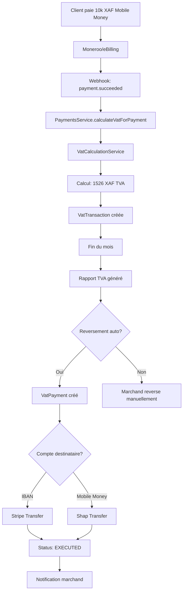

# 📱 TVA et Reversement pour Mobile Money (Moneroo, eBilling, Shap)

## 📋 Vue d'ensemble

Lorsqu'un utilisateur paie avec **Mobile Money** via **Moneroo**, **eBilling** ou **Shap**, le système de TVA de BööhPay fonctionne **de manière identique**, peu importe le provider utilisé. La TVA est calculée **sur le montant du paiement**, et le reversement peut être effectué via différents moyens selon la configuration.

---

## 🔄 Flux complet : Du Paiement au Reversement

### 1️⃣ Paiement Mobile Money Réussi

```
┌─────────────────────────────────────────────────────────┐
│  Client paie 10 000 XAF avec Mobile Money               │
│  Provider: Moneroo / eBilling / Shap                    │
└────────────────────┬────────────────────────────────────┘
                     │
                     ▼
┌─────────────────────────────────────────────────────────┐
│  Webhook reçu : payment.succeeded                       │
│  Payment Status: SUCCEEDED                              │
└────────────────────┬────────────────────────────────────┘
                     │
                     ▼
┌─────────────────────────────────────────────────────────┐
│  PaymentsService.calculateVatForPayment()               │
│  ✅ Vérifie si TVA activée pour le marchand             │
│  ✅ Extrait: amount, country, currency, metadata        │
└────────────────────┬────────────────────────────────────┘
                     │
                     ▼
┌─────────────────────────────────────────────────────────┐
│  VatCalculationService.calculateVat()                   │
│  • sellerCountry: "GA" (Gabon)                          │
│  • buyerCountry: "GA" (détecté depuis phone/pays)       │
│  • amount: 10000 XAF (montant reçu du provider)         │
│  • currency: "XAF"                                      │
│  • productCategory: "digital" (depuis metadata)         │
└────────────────────┬────────────────────────────────────┘
                     │
                     ▼
┌─────────────────────────────────────────────────────────┐
│  Calcul TVA : 18% (Gabon, digital)                      │
│  • amount_gross: 10000 (TTC)                            │
│  • amount_net: 8474 (HT)                                │
│  • vat_amount: 1526 (TVA collectée)                     │
└────────────────────┬────────────────────────────────────┘
                     │
                     ▼
┌─────────────────────────────────────────────────────────┐
│  Enregistrement VatTransaction                          │
│  • payment_id: "uuid-payment"                           │
│  • vat_amount: 1526 XAF                                 │
│  • vat_rate_id: "uuid-rate-18%"                         │
└─────────────────────────────────────────────────────────┘
```

**⚠️ Important** : La TVA est calculée **indépendamment du provider** (Moneroo, eBilling, Shap). Le montant reçu du provider est le montant **TTC** (Toutes Taxes Comprises), et le système calcule automatiquement le montant HT et la TVA.

---

## 🏦 Reversement de la TVA Collectée

### Option A : Reversement Automatique (Recommandé)

Si le marchand a activé le **reversement automatique** :

```
┌─────────────────────────────────────────────────────────┐
│  1. Job Scheduler (Cron)                                │
│     Tous les 1er du mois à 2h du matin                  │
└────────────────────┬────────────────────────────────────┘
                     │
                     ▼
┌─────────────────────────────────────────────────────────┐
│  2. VatReportsService                                   │
│     • Génère rapport mensuel/trimestriel                │
│     • Somme toutes les transactions TVA                 │
│     • Status: SUBMITTED                                 │
└────────────────────┬────────────────────────────────────┘
                     │
                     ▼
┌─────────────────────────────────────────────────────────┐
│  3. VatPaymentsService                                  │
│     • Crée VatPayment (status: PENDING)                 │
│     • Montant: Total TVA collectée                      │
│     • Compte destinataire: reversementAccount           │
└────────────────────┬────────────────────────────────────┘
                     │
                     ▼
┌─────────────────────────────────────────────────────────┐
│  4. Choix du Provider selon le Compte                   │
│                                                          │
│  A) Si compte bancaire (IBAN)                           │
│     → Utilise PayoutsService avec Stripe                │
│     → Transfert bancaire SEPA/international             │
│                                                          │
│  B) Si compte Mobile Money                              │
│     → Utilise PayoutsService avec Shap/Moneroo          │
│     → Transfert vers numéro de téléphone                │
│                                                          │
│  C) Si compte fiscal local                              │
│     → Utilise PayoutsService selon pays                 │
│     → Provider spécifique (partenaire local)            │
└────────────────────┬────────────────────────────────────┘
                     │
                     ▼
┌─────────────────────────────────────────────────────────┐
│  5. Exécution du Transfert                              │
│     • Provider: Stripe / Moneroo / Shap / Partenaire    │
│     • Transaction externe créée                         │
│     • Status: PROCESSING → EXECUTED                     │
└────────────────────┬────────────────────────────────────┘
                     │
                     ▼
┌─────────────────────────────────────────────────────────┐
│  6. Notification & Audit                                │
│     • Email au marchand                                 │
│     • Rapport marqué: PAID                              │
│     • Log d'audit créé                                  │
└─────────────────────────────────────────────────────────┘
```

### Option B : Reversement Manuel

Si le reversement automatique est **désactivé** :

1. Le marchand génère un rapport TVA périodique
2. Il voit le montant total à reverser
3. Il effectue manuellement le virement vers l'administration fiscale
4. Il marque le rapport comme "Payé" dans l'interface

---

## 🔧 Spécificités par Provider

### 📱 Moneroo (Mobile Money Afrique)

**Pays supportés** : Cameroun, Côte d'Ivoire, Sénégal, Ouganda, Tanzanie, Rwanda, etc.

**Calcul TVA** :
- Montant reçu : 10 000 XAF (TTC)
- TVA calculée : 1 526 XAF (18% si Gabon)
- Montant HT : 8 474 XAF

**Reversement** :
- **Si compte bancaire** : Utilise Stripe pour transfert international
- **Si compte Mobile Money** : Utilise Shap ou Moneroo pour transfert vers téléphone
- Le provider utilisé pour le reversement **n'a pas d'impact** sur le calcul de TVA

**Exemple** :
```typescript
// Paiement Moneroo réussi
{
  paymentId: "pay_123",
  amountMinor: 10000,
  currency: "XAF",
  gatewayUsed: "MONEROO",
  countryCode: "CM" // Cameroun
}

// TVA calculée automatiquement
{
  vat_amount: 1500, // 15% TVA Cameroun
  amount_net: 8500,
  amount_gross: 10000
}
```

---

### 🇬🇦 eBilling (Mobile Money Gabon)

**Pays supporté** : Gabon uniquement

**Spécificités** :
- Supporte **Airtel Money** et **Moov Money Gabon**
- Détection automatique du système (Airtel vs Moov) depuis le numéro de téléphone
- TVA : **18%** pour les produits digitaux au Gabon

**Calcul TVA** :
- Montant reçu : 10 000 XAF (TTC)
- TVA calculée : 1 526 XAF (18%)
- Montant HT : 8 474 XAF

**Reversement** :
- **Si compte bancaire gabonais** : Utilise partenaire local ou Stripe
- **Si compte Mobile Money** : Utilise Shap pour transfert vers Airtel/Moov
- Le provider eBilling est utilisé **uniquement pour recevoir**, pas pour reverser

**Exemple** :
```typescript
// Paiement eBilling réussi
{
  paymentId: "pay_456",
  amountMinor: 10000,
  currency: "XAF",
  gatewayUsed: "EBILLING",
  countryCode: "GA",
  metadata: {
    phone: "0743998524",
    paymentSystem: "airtelmoney"
  }
}

// TVA calculée automatiquement
{
  vat_amount: 1526, // 18% TVA Gabon
  amount_net: 8474,
  amount_gross: 10000,
  buyer_country: "GA"
}
```

---

### 💸 Shap (Versements Mobile Money Gabon)

**Usage** : **Uniquement pour les versements** (payouts), pas pour recevoir des paiements

**Rôle dans la TVA** :
- Shap est utilisé **exclusivement pour le reversement** de TVA
- Si le compte de reversement est un numéro Mobile Money (Airtel/Moov), Shap effectue le transfert

**Exemple de reversement via Shap** :
```typescript
// Reversement TVA vers Mobile Money
{
  vatPaymentId: "vat_pay_789",
  amount: 1526, // TVA collectée
  currency: "XAF",
  recipientAccount: "0743998524", // Numéro Mobile Money
  provider: "SHAP",
  status: "EXECUTED"
}
```

**⚠️ Note** : Shap n'est **jamais** utilisé pour calculer ou recevoir la TVA, seulement pour la reverser si le compte destinataire est Mobile Money.

---

## 💡 Exemples Concrets

### Exemple 1 : Paiement Moneroo → Reversement Stripe

**Scénario** :
- Client au **Cameroun** paie **10 000 XAF** avec Mobile Money via **Moneroo**
- TVA : **15%** (Cameroun, produits digitaux)
- Reversement automatique vers **compte bancaire IBAN** de l'administration fiscale

**Flux** :
```
1. Paiement Moneroo : 10 000 XAF reçu
   ↓
2. Calcul TVA :
   - Montant TTC : 10 000 XAF
   - TVA (15%) : 1 500 XAF
   - Montant HT : 8 500 XAF
   ↓
3. Fin du mois : Rapport généré
   - Total TVA collectée : 1 500 XAF
   ↓
4. Reversement automatique :
   - Provider : Stripe (car compte IBAN)
   - Transfert : 1 500 XAF vers IBAN de l'administration
   - Status : EXECUTED
```

---

### Exemple 2 : Paiement eBilling → Reversement Shap

**Scénario** :
- Client au **Gabon** paie **10 000 XAF** avec **Airtel Money** via **eBilling**
- TVA : **18%** (Gabon, produits digitaux)
- Reversement automatique vers **numéro Mobile Money** de l'administration fiscale

**Flux** :
```
1. Paiement eBilling : 10 000 XAF reçu
   ↓
2. Calcul TVA :
   - Montant TTC : 10 000 XAF
   - TVA (18%) : 1 526 XAF
   - Montant HT : 8 474 XAF
   ↓
3. Fin du mois : Rapport généré
   - Total TVA collectée : 1 526 XAF
   ↓
4. Reversement automatique :
   - Provider : Shap (car compte Mobile Money)
   - Transfert : 1 526 XAF vers numéro Airtel/Moov
   - Status : EXECUTED
```

---

### Exemple 3 : Multi-Pays avec Moneroo

**Scénario** :
- Marchand basé au **Gabon** (sellerCountry: "GA")
- Clients dans différents pays :
  - **Gabon** : 10 000 XAF → TVA 18% = 1 526 XAF
  - **Cameroun** : 10 000 XAF → TVA 15% = 1 500 XAF
  - **Côte d'Ivoire** : 10 000 XOF → TVA 18% = 1 525 XOF

**Flux** :
```
Paiements Moneroo multiples :
  - Transaction 1 (GA) : TVA 1 526 XAF
  - Transaction 2 (CM) : TVA 1 500 XAF
  - Transaction 3 (CI) : TVA 1 525 XOF
   ↓
Rapport mensuel :
  - Total TVA Gabon : 1 526 XAF
  - Total TVA Cameroun : 1 500 XAF
  - Total TVA Côte d'Ivoire : 1 525 XOF
   ↓
Reversements séparés par pays :
  - Gabon : Reversement vers compte GA (Shap ou Stripe)
  - Cameroun : Reversement vers compte CM (Stripe)
  - Côte d'Ivoire : Reversement vers compte CI (Stripe)
```

---

## 🔍 Points Importants à Retenir

### ✅ TVA Indépendante du Provider

- Le **calcul de TVA** est **identique** pour tous les providers (Moneroo, eBilling, Stripe)
- Le montant reçu du provider est toujours le montant **TTC** (Toutes Taxes Comprises)
- Le système calcule automatiquement : `HT = TTC - TVA`

### ✅ Reversement Flexibles

- Le **provider utilisé pour le reversement** peut être différent du provider de paiement
- **Moneroo/eBilling** → Reçoit les paiements
- **Stripe/Shap/Partenaire** → Reverse la TVA vers l'administration

### ✅ Multi-Pays Supporté

- Un marchand peut recevoir des paiements de plusieurs pays
- La TVA est calculée selon le **pays du client** (buyerCountry)
- Les rapports peuvent être générés par pays
- Les reversements peuvent être séparés par pays

### ✅ Idempotence Garantie

- Même si un webhook est reçu plusieurs fois, la TVA n'est calculée **qu'une seule fois**
- Utilise le `payment.id` comme clé d'idempotence

---

## 🎯 Configuration Requise

### Pour le Marchand

1. **Activer la TVA** dans les paramètres (`/vat/settings`)
2. **Configurer le pays vendeur** (sellerCountry)
3. **Configurer le compte de reversement** :
   - IBAN pour compte bancaire
   - Numéro de téléphone pour compte Mobile Money
4. **Choisir le mode** :
   - ✅ Reversement automatique (recommandé)
   - ❌ Reversement manuel

### Pour le Système

1. **Taux de TVA configurés** dans la base de données (`vat_rates`)
2. **Job scheduler** activé pour reversement automatique
3. **Intégration PayoutsService** pour exécuter les transferts
4. **Providers configurés** : Stripe, Moneroo, Shap

---

## 📊 Tableau Récapitulatif

| Provider | Usage | TVA Calculée | Reversement Possible |
|----------|-------|--------------|---------------------|
| **Moneroo** | Recevoir paiements Mobile Money | ✅ Oui (selon pays) | ✅ Stripe / Partenaire |
| **eBilling** | Recevoir paiements Mobile Money (Gabon) | ✅ Oui (18% Gabon) | ✅ Shap / Stripe |
| **Shap** | Versements uniquement | ❌ Non (pas de réception) | ✅ Vers Mobile Money |
| **Stripe** | Cartes bancaires | ✅ Oui (selon pays) | ✅ Vers comptes bancaires |

---

## 🔄 Workflow Complet



---

## ❓ Questions Fréquentes

### Q1 : La TVA est-elle différente selon le provider (Moneroo vs eBilling) ?

**R :** Non. La TVA dépend uniquement du **pays du client** et de la **catégorie du produit**, pas du provider utilisé pour recevoir le paiement.

### Q2 : Peut-on reverser la TVA via Mobile Money ?

**R :** Oui, si l'administration fiscale accepte les paiements Mobile Money. Utilisez **Shap** pour reverser vers un numéro Mobile Money (Airtel/Moov).

### Q3 : Comment la TVA est-elle calculée si le client paie depuis un autre pays ?

**R :** Le système utilise le `buyerCountry` (détecté depuis le numéro de téléphone ou le `countryCode` du paiement) pour déterminer le taux de TVA applicable.

### Q4 : Peut-on avoir des reversements différents par pays ?

**R :** Oui, les rapports TVA peuvent être générés par pays, et chaque pays peut avoir un compte de reversement différent.

### Q5 : Que se passe-t-il si le reversement échoue ?

**R :** Le système marque le paiement TVA comme `FAILED` et notifie le marchand. Un retry automatique est effectué selon la stratégie configurée.

---

**Version** : 1.0.0  
**Dernière mise à jour** : Novembre 2025

